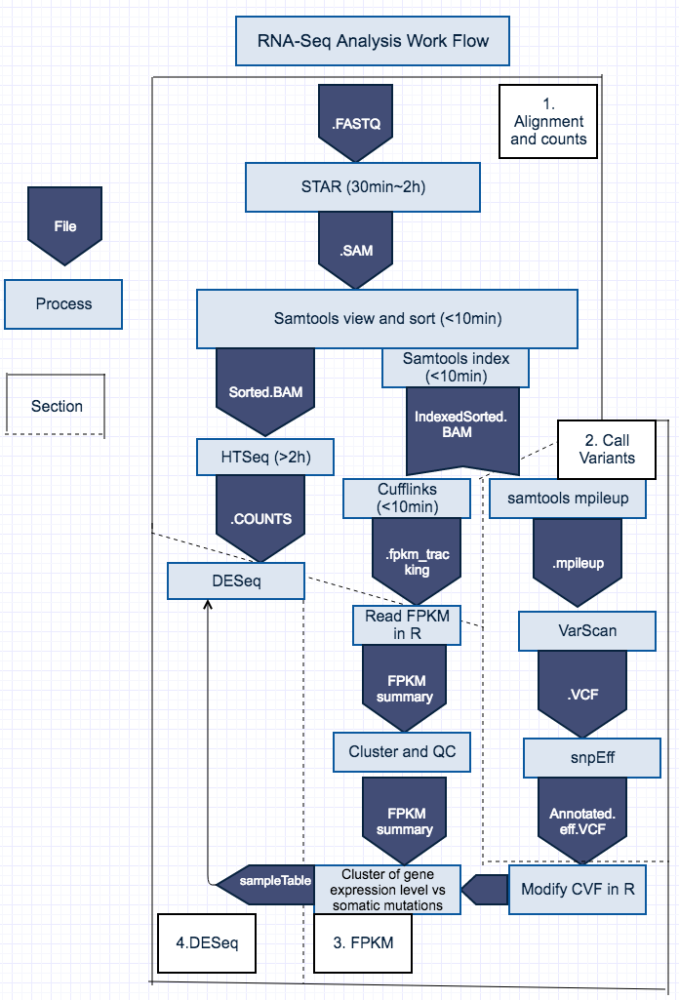

---------------------------------------------- 
RNA-Seq Analysis Pipeline: detecting mutations in RNA-Seq samples, exam genotype vs phenotype relationship 
Author: Yang Hu 
Department of Physiology and Biophysics 
Weill Cornell Medicine 
Email: yah2014@med.cornell.edu;Hu.Yang@nyu.edu 
---------------------------------------------- 

## I. Introduction

This RNA-Seq Analysis pipeline has four sections:

1) Alignment and Counts 
Including STAR alignment, Samtools sort, HTSeq Count, and Cufflinks. Must be performed in the high-performance computing enviroment.

2) Call Somatic mutations and annotate vcf 
Including Mpileup, Varscan, and SnpEff. Preferably be performed in the high-performance computing enviroment.

3) Summarize FPKM, QC and cluster 
Including mutation data clean, FPKM data clean, QC, hclust, and mutation/expression comparison. Can be performed on a local machine.

4) DESeq for gene level comparision 
DESeq and downstram analysis. Can be performed on a local machine.

## II. Work flow

### 1). Alignment_and_Counts.sh

  Input Materials: 
  -i `Sample.fastq.gz` 
  
  Output Materials: 
  -o samtools `Sample_name_sorted.bam`,`Sample_sorted.bam`,`Sample_sorted.bam.bai` 
  -o HTSeq `Sample.bam.count` 
  -o CuffLinks `genes.fpkm_tracking`,`genes.fpkm_tracking`, `genes.fpkm_tracking`, `genes.fpkm_tracking` 
  
  Linux bash shell script is here:https://github.com/nyuhuyang/RNA-Seq-Analysis/blob/master/Shell%20script/Alignment_and_Counts.sh 
  This bash shell is written for analyzing multiple projects. One project will have multiple RNA-seq samples.
  
  For example, there are total 155 Waldenström Macroglobulinemia (more than one terabyte) RNA-seq data from two projects("WTCHG" and "zhunter"). 
  The PROJECT_NAME can be changed to fit different projects.
  
###  2). CallVar_and_Annotation.sh

  Input Materials: 
  -i `Sample_sorted.bam`,`Sample_sorted.bam.bai` 
  
  Output Materials: 
  -o samtools mpileup `${PROJECT_NAME}.mpileup` 
  -o VarScan `${PROJECT_NAME}_mutations.vcf` 
  -o snpEff `${PROJECT_NAME}_Annotated.eff.vcf` 
  
  Linux bash shell script is here:https://github.com/nyuhuyang/RNA-Seq-Analysis/blob/master/Shell%20script/CallVar_and_Annotation.sh
  
### 2-1). If want to merge two Annotated.eff.vcf from two projects, run following script:
  #merge multiple Annotated.eff.vcf files with bcftools: 
  file1=path to file1/${PROJECT_NAME}_Annotated.eff.vcf 
  file1=path to file2/${PROJECT_NAME}_Annotated.eff.vcf 
  bgzip $file1 
  bgzip $file1 
  file1=${file1}.gz 
  file2=${file2}.gz 
  tabix $file1 
  tabix $file2 
  bcftools merge -o {merged vcf name}.vcf $file1 $file2 
  grep -v "##" {merged vcf name}.vcf > {merged vcf name2}.vcf  #remove header

    
### 3) Summarize FPKM, QC and cluster
   Input Materials: 
  -i `{merged vcf name2}.vcf` 
  
  Output Materials: 
  -o boxplot 
  -o hclust 
  -o Heatmap 
  R code is here:https://github.com/nyuhuyang/RNA-Seq-Analysis/blob/master/R/Analyzing%20somatic%20mutations%20in%20RNA-seq%20data.R 
    If you are a visual person and want to see the results, please click here: https://htmlpreview.github.io/?https://github.com/nyuhuyang/RNA-Seq-Analysis/blob/master/R%20Markdown%20HTML/Analyzing_somatic_mutations_in_RNA-seq_data.html
  
### 4). DESeq for gene level comparision
   Input Materials: 
  -i `Sample_table_${PROJECT_NAME}.csv` (table with samples annotation) 
  -i `Sample.bam.count` (HTSeq-count files) 
  
  Output Materials: 
  -i gene expression analysis
  R code is here: https://github.com/nyuhuyang/RNA-Seq-Analysis/blob/master/R/Analyzing%20somatic%20mutations%20in%20RNA-seq%20data.R 
  If you are a visual person and want to see the results, please click here: https://rawgit.com/nyuhuyang/RNA-Seq-Analysis/master/R%20Markdown%20HTML/rnaseq_gene_level.html

 ## III. Requirement
  
  System requirements:
  >40 GB memory high-performance computing (HPC) environment, prefer Sun Grid Engine.
  Linux and Mac OS 64 bit system
  
  Software requirement:
  R 3.3.2 
  python2.7 in server
